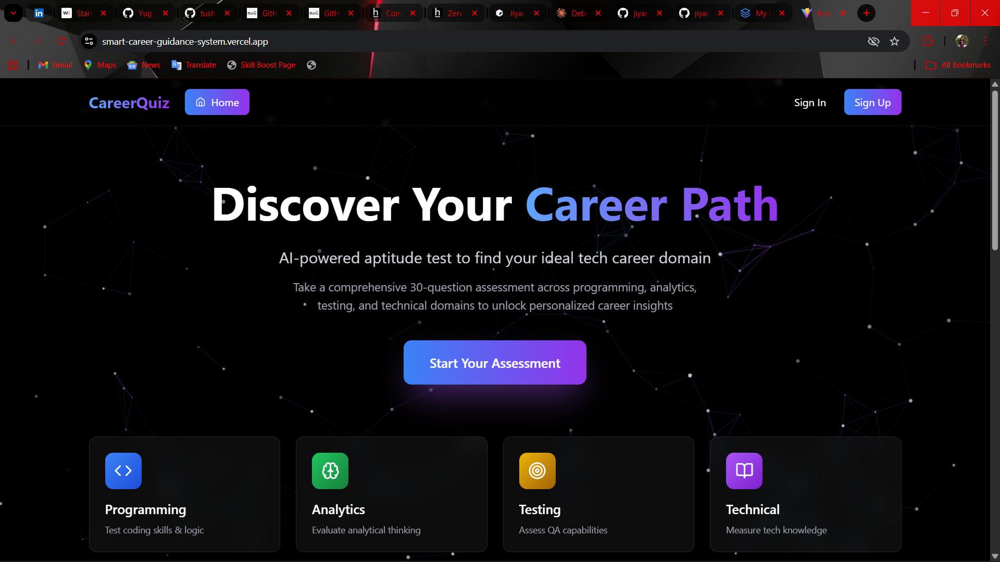
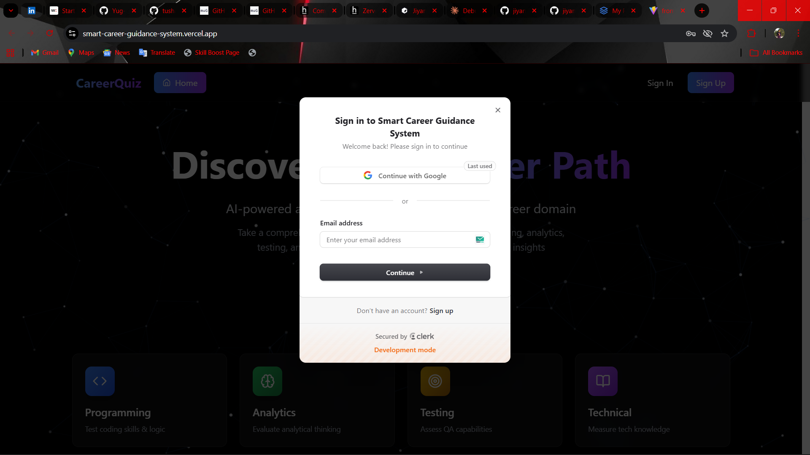
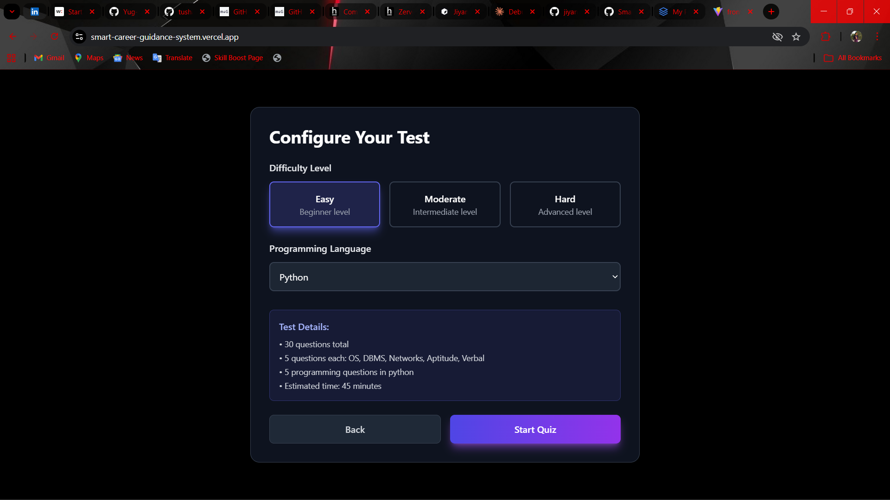
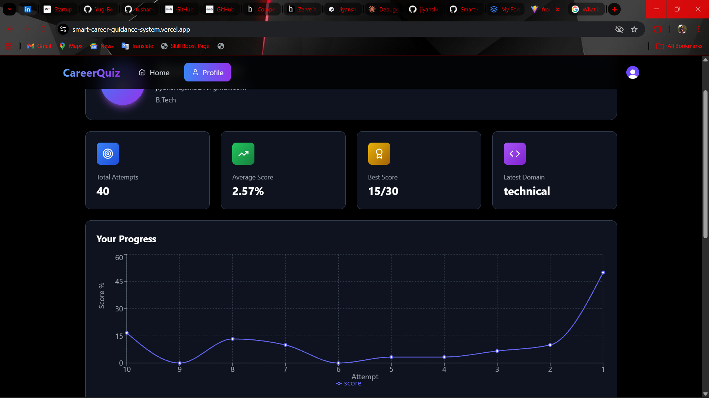
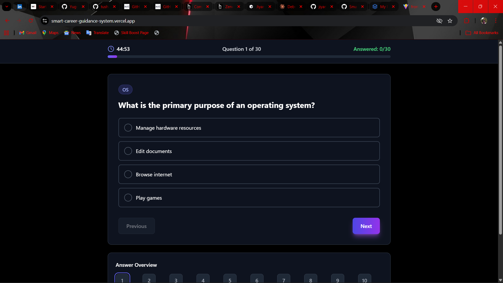
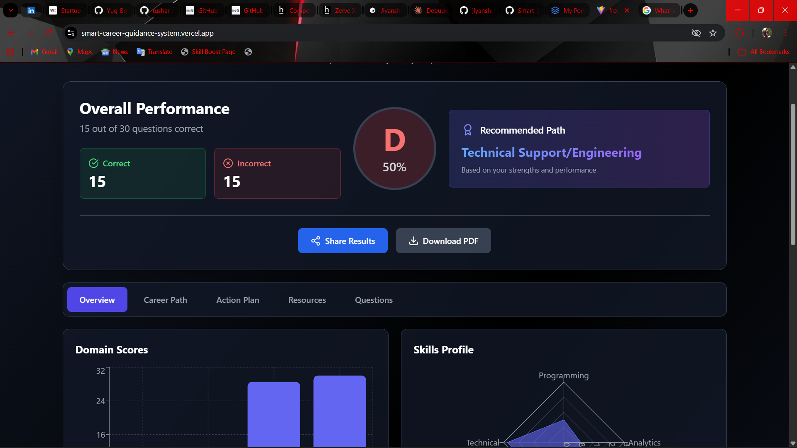
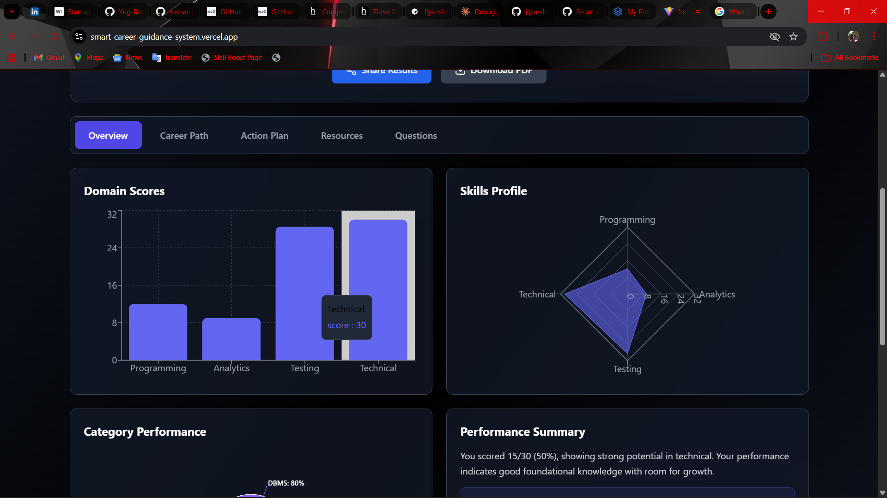
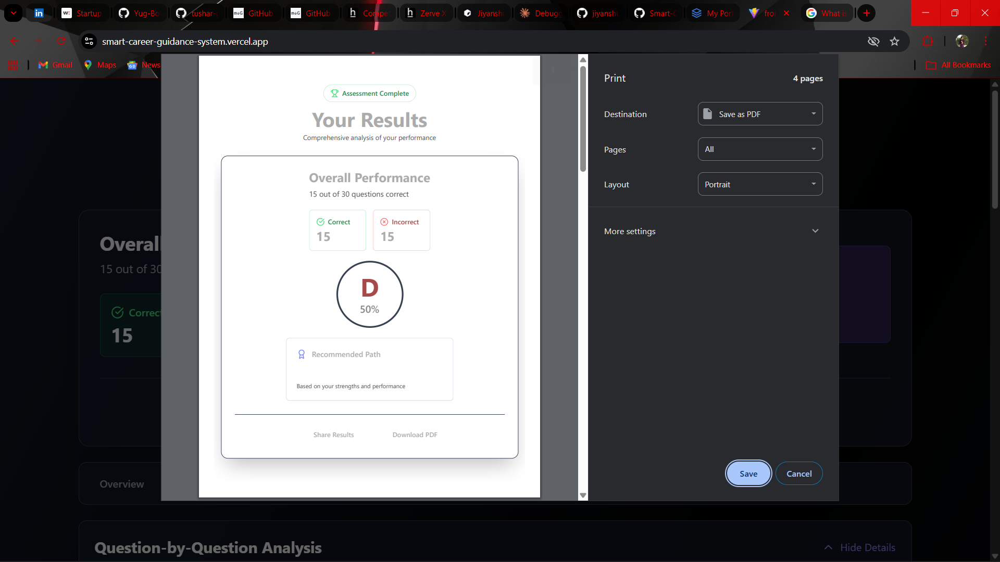

# 🚀 Smart Career Guidance System

> An AI-powered career guidance platform that helps students discover their ideal career path through intelligent skill assessments and personalized recommendations.

[](https://smart-career-guidance-system.vercel.app/)
[](https://github.com/yourusername/smart-career-guidance-system)
[](https://react.dev)
[](https://flask.palletsprojects.com/)
[](https://supabase.com)
[](https://ai.google.dev)

## 📖 Table of Contents
- [Overview](#-overview)
- [Features](#-features)
- [Screenshots](#-screenshots)
- [Tech Stack](#-tech-stack)
- [Project Structure](#-project-structure)
- [Getting Started](#-getting-started)
- [Deployment](#-deployment)
- [Documentation](#-documentation)
- [Contributing](#-contributing)
- [License](#-license)

## 🌟 Overview

Smart Career Guidance System is a comprehensive platform that leverages **Google Gemini AI** to generate personalized career assessments and provide data-driven recommendations. Students can take adaptive quizzes, track their progress, and receive AI-powered insights into their ideal career paths.

**Live Demo**: [https://smart-career-guidance-system.vercel.app/](https://smart-career-guidance-system.vercel.app/)

### Key Highlights
- 🎯 **30-Question Adaptive Quizzes** covering 6 domains
- 🤖 **Google Gemini AI** for intelligent question generation
- 📊 **Comprehensive Analytics** with detailed performance breakdowns
- 💾 **Cloud Database** powered by Supabase
- 🔐 **Secure Authentication** using Clerk
- 📱 **Fully Responsive Design** for all devices
- ⚡ **Production Ready** and Scalable Architecture

## ✨ Features

### 🎯 Core Features
- **Intelligent Quiz Generation** - AI-powered adaptive questionnaires
- **Multi-Domain Assessment** - OS, DBMS, Networks, Aptitude, Verbal, Programming
- **Real-time Progress Tracking** - Live timer and completion indicators
- **Comprehensive Results Analysis** - Detailed performance breakdowns with visualizations
- **User Profile Management** - Complete assessment history and statistics
- **Personalized Recommendations** - AI-generated career paths and action plans

### 🎨 User Experience
- **Modern UI Design** - Glassmorphism with gradient accents
- **Floating Stars Animation** - Interactive canvas-based background
- **Dark Theme** - Eye-friendly interface
- **Fully Responsive** - Optimized for mobile, tablet, desktop
- **Smooth Animations** - Polished transitions and interactions

### 🔐 Security & Authentication
- **Clerk Integration** - Industry-standard authentication
- **JWT Tokens** - Secure API communication
- **Protected Routes** - Session-based access control
- **Environment Variables** - Sensitive data protection

### 📊 Analytics & Insights
- **Domain Score Analysis** - Programming, Analytics, Testing, Technical
- **Category Breakdown** - Performance by topic
- **Progress Charts** - Historical performance tracking
- **AI-Generated Insights** - Career recommendations with URLs
- **Action Plans** - Personalized learning roadmaps

## 📸 Screenshots

### 🏠 Home Page


*Landing page featuring animated background and quick navigation*

### 🔐 Authentication


*Secure sign-in and sign-up powered by Clerk*

### 🎮 Quiz Configuration


*Select difficulty level and programming language before starting*

### ⏱️ Progress Bar & History


*Real-time progress tracking and quiz attempt history*

### ❓ Quiz Questions


*Interactive multiple-choice questions with instant feedback*

### 📊 Performance Analysis


*Domain-wise performance visualization and analytics*

### 📈 Overview Results


*Comprehensive results with grade, score, and recommendations*

### 📥 Download Results


*Option to download and share assessment results*

## 🛠️ Tech Stack

### Frontend
```
React 19.2.0                 - UI Framework
Vite 7.2.2                   - Build Tool
Tailwind CSS 3.4.18          - Styling
React Router 7.9.6           - Navigation
Recharts 3.4.1               - Data Visualization
Clerk React 5.55.0           - Authentication
Lucide React 0.553.0         - Icons
```

### Backend
```
Flask 3.0.0                  - Web Framework
Python 3.x                   - Runtime
Gunicorn 21.2.0              - Production Server
Google Generative AI 0.3.2   - Gemini API
Supabase 2.9.1               - Database Client
PyJWT                        - Token Handling
```

### Database & Cloud
```
Supabase (PostgreSQL)        - Cloud Database
Google Cloud                 - Gemini AI
Vercel                       - Frontend Deployment
Render/Railway               - Backend Deployment
```

### Development Tools
```
ESLint 9.39.1                - Code Linting
PostCSS 8.5.6                - CSS Processing
Autoprefixer                 - Browser Compatibility
```

## 📁 Project Structure

```
Smart Career Guidance System/
├── frontend/                          # React Application
│   ├── src/
│   │   ├── components/               # React Components
│   │   │   ├── Home.jsx             # Landing Page
│   │   │   ├── Quiz.jsx             # Quiz Interface
│   │   │   ├── QuizConfig.jsx       # Configuration
│   │   │   ├── ResultPage.jsx       # Results & Analytics
│   │   │   ├── Profile.jsx          # User Profile
│   │   │   └── FloatingStarsBackground.jsx
│   │   ├── App.jsx                  # Main App with Routing
│   │   ├── main.jsx                 # Entry Point
│   │   └── index.css, App.css       # Styles
│   ├── package.json                 # Dependencies
│   ├── vite.config.js               # Vite Config
│   ├── tailwind.config.js           # Tailwind Config
│   ├── eslint.config.js             # Linting Config
│   └── README.md                    # Frontend Documentation
│
├── backend/                           # Flask API
│   ├── main.py                      # Main Application & Routes
│   ├── db.py                        # Supabase Database Manager
│   ├── user_supabase.py             # User Operations
│   ├── verify_setup.py              # Setup Verification
│   ├── requirements.txt             # Dependencies
│   ├── .env                         # Environment Variables
│   └── README.md                    # Backend Documentation
│
├── images/                            # Project Screenshots
│   ├── home-page.png
│   ├── Auth.png
│   ├── Langauge-level.png
│   ├── Progress-bar.png
│   ├── Questions.png
│   ├── Performance.png
│   ├── Overview-other.png
│   └── Download-result.png
│
└── README.md                         # This File
```

## 🚀 Getting Started

### Prerequisites
- **Node.js** 18+ and **npm**
- **Python** 3.8+ with **pip**
- **Git** for version control
- **Supabase Account** (free tier available)
- **Google API Key** for Gemini
- **Clerk Account** for authentication

### Frontend Setup

1. **Clone and navigate**
```bash
git clone <repository-url>
cd frontend
```

2. **Install dependencies**
```bash
npm install
```

3. **Configure environment**
```env
VITE_CLERK_PUBLISHABLE_KEY=your_key_here
```

4. **Start development server**
```bash
npm run dev
```

Access at `http://localhost:5173`

### Backend Setup

1. **Navigate to backend**
```bash
cd backend
```

2. **Create virtual environment**
```bash
python -m venv venv
source venv/bin/activate  # Windows: venv\Scripts\activate
```

3. **Install dependencies**
```bash
pip install -r requirements.txt
```

4. **Configure environment**
Create `.env` file:
```env
SECRET_KEY=your-secret-key
SUPABASE_URL=your_supabase_url
SUPABASE_ANON_KEY=your_anon_key
SUPABASE_SERVICE_KEY=your_service_key
GEMINI_API_KEY=your_gemini_key
CLERK_SECRET_KEY=your_clerk_key
CLERK_FRONTEND_API=your_clerk_domain
FLASK_ENV=development
PORT=5000
```

5. **Verify setup**
```bash
python verify_setup.py
```

6. **Start server**
```bash
python main.py
```

Access at `http://localhost:5000`

### Database Setup (Supabase)

Run the SQL schema in your Supabase SQL Editor:

```sql
-- See backend/README.md for complete SQL schema
-- Key tables: users, quiz_sessions, quiz_questions, results
```

Detailed database setup instructions are in [backend/README.md](./backend/README.md#-database-setup)

## 🌐 Deployment

### Frontend Deployment (Vercel)

1. **Push code to GitHub**
```bash
git push origin main
```

2. **Import on Vercel**
- Go to vercel.com
- Click "New Project"
- Select your repository
- Configure build settings

3. **Set Environment Variables**
```
VITE_CLERK_PUBLISHABLE_KEY = your_key
VITE_API_BASE_URL = your_backend_url
```

4. **Deploy**
```bash
vercel --prod
```

**Live**: https://smart-career-guidance-system.vercel.app/

### Backend Deployment (Render/Railway)

#### Option 1: Render.com
1. Connect GitHub repository
2. Create new Web Service
3. Configure:
   - Build Command: `pip install -r requirements.txt`
   - Start Command: `gunicorn main:app`
4. Add environment variables
5. Deploy

#### Option 2: Railway.app
1. Create new project from GitHub
2. Auto-detect Python environment
3. Add environment variables
4. Deploy

#### Option 3: Heroku Alternative
```bash
git push heroku main
```

### Environment Variables (Production)
- `FLASK_ENV=production`
- Use `SUPABASE_SERVICE_KEY` for database
- Configure CORS for your frontend domain
- Enable HTTPS

## 📚 Documentation

### Detailed Documentation
- **[Frontend Documentation](./frontend/README.md)** - React app setup, components, features
- **[Backend Documentation](./backend/README.md)** - API endpoints, database schema, configuration

### API Documentation
All API endpoints are documented in [backend/README.md](./backend/README.md#-api-endpoints)

Key Endpoints:
- `POST /api/quiz/generate` - Generate new quiz
- `POST /api/quiz/submit` - Submit answers
- `GET /api/profile` - Get user profile
- `GET /api/profile/attempts` - Get history

## 🎯 Quiz Details

### Question Categories (30 Total)
- **Operating Systems** (5 questions)
- **Database Management** (5 questions)
- **Computer Networks** (5 questions)
- **Aptitude** (5 questions)
- **Verbal** (5 questions)
- **Programming** (5 questions in selected language)

### Difficulty Levels
- **Easy** - Beginner concepts
- **Moderate** - Intermediate understanding (recommended)
- **Hard** - Advanced problem-solving

### Supported Languages
Python, Java, JavaScript, C++, C#, Go, Ruby, PHP

### Duration
45 minutes (auto-submit on timeout)

## 📊 Career Domains

Results categorize users into:
1. **Programmer/Developer** - Software development focus
2. **Data Analyst** - Analytics and insights
3. **QA Engineer** - Quality assurance and testing
4. **Technical Support** - Technical engineering roles

## 🎨 Features Showcase

| Feature | Description | Status |
|---------|-------------|--------|
| AI Quiz Generation | Gemini-powered 30-question quizzes | ✅ |
| Multi-Domain Testing | 6 assessment categories | ✅ |
| Real-time Analytics | Live charts and graphs | ✅ |
| Personalized Insights | AI career recommendations | ✅ |
| User Profiles | Complete assessment history | ✅ |
| Progress Tracking | Performance over time | ✅ |
| Mobile Responsive | Works on all devices | ✅ |
| Secure Auth | Clerk integration | ✅ |
| Cloud Database | Supabase PostgreSQL | ✅ |
| Share Results | Shareable result links | ✅ |

## 🔧 Configuration

### Key Configuration Files

**Frontend** (`frontend/vite.config.js`)
```javascript
- React Fast Refresh
- Optimized build
```

**Backend** (`backend/main.py`)
```python
- Flask CORS configuration
- Gemini AI setup
- Rate limiting (30 RPM)
```

**Database** (`backend/db.py`)
```python
- Supabase client initialization
- Table operations
- Query builders
```

## 🧪 Testing

### Manual Testing
```bash
# Frontend
npm run lint          # Check code quality
npm run build         # Build production
npm run preview       # Preview build

# Backend
python verify_setup.py    # Check environment
python main.py --debug    # Run with debugging
```

### Test Workflow
1. Create account with Clerk
2. Select quiz difficulty & language
3. Complete 30 questions
4. Verify results & insights
5. Check profile history

## 📈 Performance

### Metrics
- **Bundle Size**: ~350KB (gzipped)
- **Initial Load**: < 2 seconds
- **Lighthouse Score**: 90+
- **API Response**: < 500ms
- **Database Queries**: Indexed for speed

### Optimizations
- Code splitting with Vite
- React memo for components
- Canvas animation optimization
- Bulk database operations
- Single AI API call for all questions

## 🔒 Security

### Best Practices Implemented
- JWT authentication with Clerk
- CORS configuration
- Environment variable protection
- SQL injection prevention (Supabase)
- Rate limiting on API calls
- HTTPS in production
- RLS policies on database

## 🤝 Contributing

### Development Workflow
1. Fork repository
2. Create feature branch: `git checkout -b feature/amazing-feature`
3. Make changes and test
4. Commit: `git commit -m 'Add amazing feature'`
5. Push: `git push origin feature/amazing-feature`
6. Open Pull Request

### Code Style
- Follow PEP 8 (Python)
- Use ESLint (JavaScript)
- Add comments for complex logic
- Keep functions focused
- Write meaningful commit messages

## 📝 License

This project is licensed under the MIT License - see LICENSE file for details.

## 🙏 Acknowledgments

Thanks to **Arunima** for the ideation and concept!

- **Google Gemini AI** for intelligent question generation
- **Supabase** for reliable cloud database
- **Clerk** for secure authentication
- **Vercel** for seamless frontend deployment
- **React & Flask communities** for amazing frameworks
- All contributors and testers

## ️ Roadmap

### Upcoming Features
- [ ] Multi-language support (i18n)
- [ ] Dark/Light theme toggle
- [ ] Advanced leaderboards
- [ ] Social sharing integration
- [ ] Video explanations for questions
- [ ] Timed practice mode
- [ ] Peer comparison
- [ ] Downloadable certificates
- [ ] Mobile app (React Native)
- [ ] Machine learning predictions

## 🎓 Learning Resources

### Used Technologies
- [React Documentation](https://react.dev)
- [Flask Official Docs](https://flask.palletsprojects.com/)
- [Supabase Docs](https://supabase.com/docs)
- [Google Gemini API](https://ai.google.dev)
- [Clerk Documentation](https://clerk.com/docs)
- [Tailwind CSS](https://tailwindcss.com/docs)

---

<div align="center">

### 🌟 Show Your Support
If you find this project helpful, please give it a ⭐ on GitHub!

**Live Demo**: [https://smart-career-guidance-system.vercel.app/](https://smart-career-guidance-system.vercel.app/)

Ideation by **Arunima** ✨

</div>
